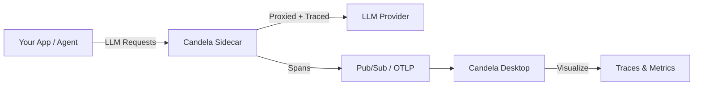

# 🕯️ Candela

**See what your LLMs are doing.**

Candela is an open-source observability platform for LLM traffic — trace requests, monitor costs, and manage providers across your AI infrastructure.

[Get Started](getting-started/index.md){ .md-button .md-button--primary }
[View on GitHub](https://github.com/candelahq/candela){ .md-button }

---

## Why Candela?

-   :material-eye-outline:{ .lg .middle } **Full Visibility**

    ---

    Trace every LLM request end-to-end with OpenTelemetry-native distributed tracing. See latency, tokens, and costs in real time.

-   :material-shield-check-outline:{ .lg .middle } **Provider Management**

    ---

    Add, configure, and switch between LLM providers — OpenAI, Gemini, Ollama, LM Studio — from a single desktop interface.

-   :material-server-outline:{ .lg .middle } **Lightweight Sidecar**

    ---

    Drop a < 5MB proxy binary next to your containers. Zero-config ADC authentication for GCP workloads.

-   :material-code-braces:{ .lg .middle } **Framework Agnostic**

    ---

    Works with Google ADK, LangChain, raw HTTP calls — anything that talks to an LLM endpoint.

## Architecture

## Quick Links

| Resource | Description |
|---|---|
| [Getting Started](getting-started/index.md) | Install Candela and send your first traced request |
| [Desktop App](desktop/index.md) | Manage providers and view traces |
| [Sidecar Proxy](sidecar/index.md) | Deploy the lightweight LLM proxy |
| [ADK Integration](guides/adk-integration.md) | Use Candela with Google ADK agents |
