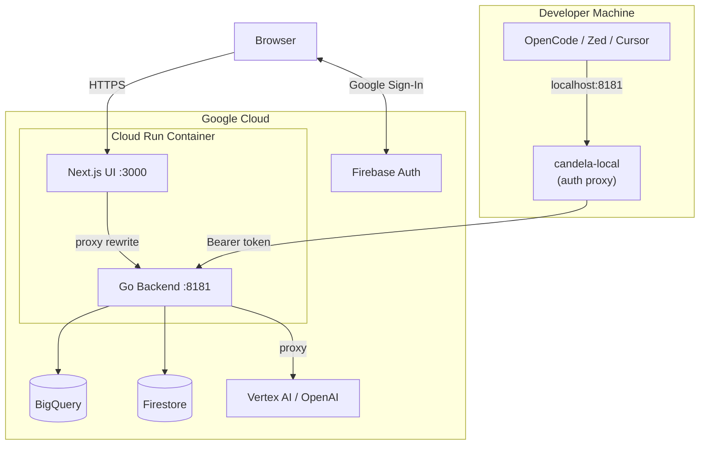
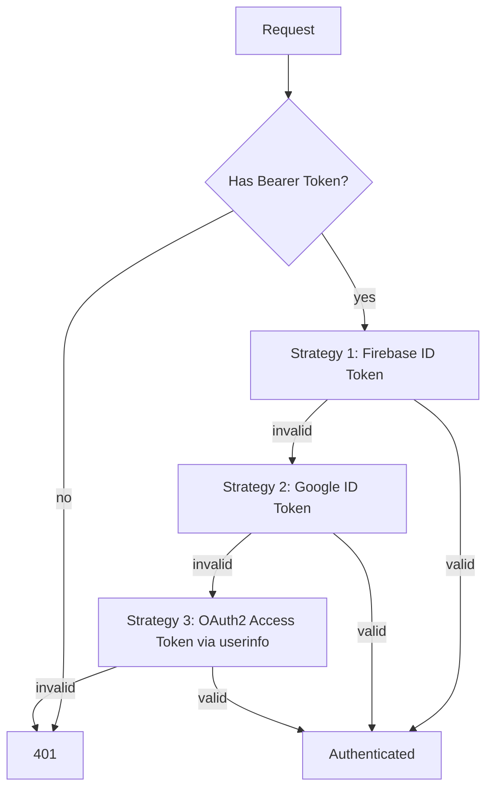

# Candela Server

`candela-server` is the full-featured Candela backend — API server, LLM proxy, span ingestion, and storage, packaged with a Next.js dashboard UI.

## Overview

| Feature | Description |
|---------|-------------|
| **LLM Proxy** | Multi-provider routing (OpenAI, Gemini, Anthropic via Vertex AI) |
| **Span Ingestion** | CQRS storage with DuckDB, SQLite, BigQuery backends |
| **Cost Engine** | Real-time token counting and cost calculation |
| **Budget Enforcement** | Per-user spending limits via Firestore |
| **Dashboard** | Next.js UI for traces, costs, and admin |
| **Auth** | Firebase Auth, Google ID tokens, OAuth2 access tokens |

## Architecture



## Authentication

The server supports three authentication strategies, tried in order:



| Strategy | Used By | Token Source |
|---|---|---|
| Firebase ID Token | Browser UI | Firebase JS SDK |
| Google ID Token | Service accounts | `idtoken.NewTokenSource()` |
| OAuth2 Access Token | candela-local (user ADC) | `gcloud auth application-default login` |

## Container Layout

The production container runs both the Go backend and Next.js UI:

```
entrypoint.sh starts:
  1. Go backend (port 8181, background)
  2. Next.js standalone (port 3000, foreground)

Next.js rewrites:
  /proxy/*         → localhost:8181
  /candela.v1.*    → localhost:8181
  /healthz         → localhost:8181
```

## Deployment

### Build & Deploy

```bash
# Build
gcloud builds submit --project $PROJECT -f deploy/cloudbuild.yaml .

# Deploy
gcloud run services update candela --project $PROJECT --region $REGION \
  --image $REGION-docker.pkg.dev/$PROJECT/candela/candela-server:latest

# Infrastructure
cd terraform && terraform apply
```

### Terraform Resources

| File | Resources |
|---|---|
| `cloud_run.tf` | Cloud Run service, IAM |
| `firebase.tf` | Firebase project, Identity Platform, authorized domains |
| `bigquery.tf` | Dataset + spans table (time-partitioned) |
| `firestore.tf` | Firestore database |
| `iam.tf` | Service account + role bindings |
| `artifact_registry.tf` | Container image registry |

## Related Docs

- [candela-local](../local/index.md) — Developer proxy that connects to this server
- [Sidecar](../sidecar/index.md) — Lightweight production proxy alternative
- [Architecture](../architecture/index.md) — CQRS storage design
