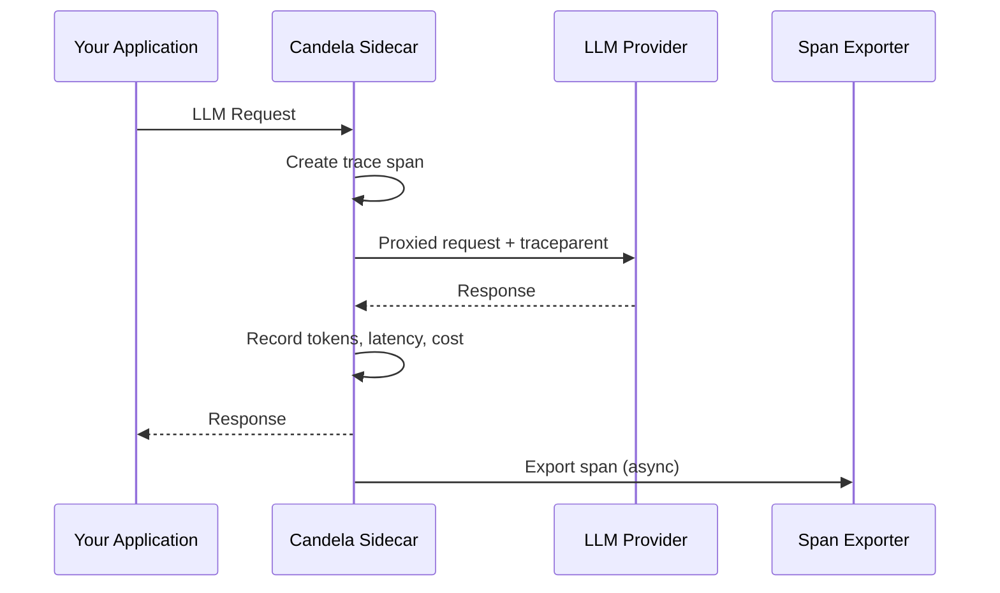

# Candela Sidecar

The Candela Sidecar is a lightweight Go proxy (< 5MB) that intercepts LLM requests, adds OpenTelemetry tracing, and routes them to the configured provider.

## How It Works

## Key Features

- **Zero-config GCP auth** — Automatic Application Default Credentials (ADC)
- **W3C Trace Context** — Full `traceparent`/`tracestate` propagation
- **Async span export** — Fire-and-forget via Pub/Sub or OTLP
- **Minimal footprint** — Single static binary, < 5MB

## Next Steps

- [Configuration](configuration.md) — Customize sidecar behavior
- [Deployment](deployment.md) — Run in production containers
