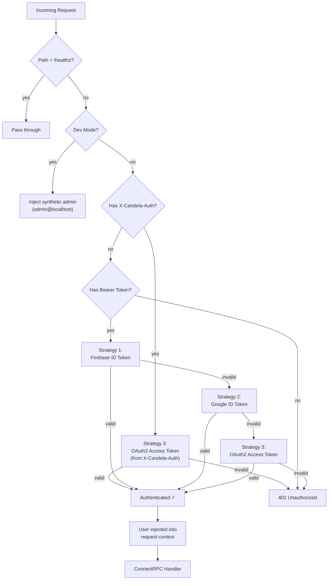

Candela uses a **multi-strategy authentication** system designed to serve three distinct client types: browser users, developer CLI tools, and service accounts.

## Authentication Flow



The middleware checks `X-Candela-Auth` first (sent by `candela` behind IAP). If absent, it falls back to three strategies on the `Authorization` header — the first successful validation wins:

| # | Strategy | Client | Token Source |
|---|----------|--------|-------------|
| — | **`X-Candela-Auth` (priority)** | `candela` behind IAP | User's ADC OAuth2 access token |
| 1 | **Firebase ID Token** | Browser UI | Firebase JS SDK |
| 2 | **Google ID Token** | Service accounts, `candela` CLI (no IAP) | `idtoken.NewTokenSource(audience)` |
| 3 | **OAuth2 Access Token** | `candela` with user ADC (no IAP) | `candela auth login` (or `gcloud auth application-default login`) |

:::note
Behind IAP, the `Authorization` header is replaced by IAP's own JWT. `X-Candela-Auth` preserves the user's real identity so the server can identify the developer. Strategy 3 calls Google's userinfo endpoint, adding ~50ms latency.
:::

---

## Service Account Policy

Candela uses a **deny-by-default** service account policy. All service account tokens are rejected with `403 Forbidden` unless explicitly allowlisted:

```yaml
# config.yaml
auth:
  allowed_service_accounts:
    - "candela-ci@my-project.iam.gserviceaccount.com"
```

If the `allowed_service_accounts` list is empty or omitted, **all** service accounts are blocked. This prevents unmetered cost vectors — SA traffic bypasses per-user budget deduction.

---

## Role-Based Access Control (RBAC)

### Roles

| Role | Description |
|------|-------------|
| `developer` | Use proxy, view own traces/costs, self-service RPCs |
| `admin` | Full access: manage users, budgets, view all data |

### RPC Access Matrix

**Self-Service RPCs** (any authenticated user):

| RPC | Description |
|-----|-------------|
| `GetCurrentUser` | Returns the caller's own profile, budget, and active grants |
| `GetMyBudget` | Returns the caller's budget and current-period spending |

**Admin-Only RPCs**:

| Category | RPCs |
|----------|------|
| **Users** | `CreateUser`, `ListUsers`, `GetUser`, `UpdateUser`, `DeactivateUser`, `ReactivateUser` |
| **Budgets** | `SetBudget`, `GetBudget`, `ResetSpend` |
| **Grants** | `CreateGrant`, `ListGrants`, `RevokeGrant` |
| **Audit** | `ListAuditLog` |

---

## Per-User Data Isolation

Non-admin developers can only see their own traces. This is enforced at two levels:

1. **Query-time filtering** — All list/search endpoints inject `user_id` filters into storage queries. Admins see all data; developers see only their own.

2. **Post-fetch auth gate** — `GetTrace` (which queries by trace ID, not user) fetches the full trace, extracts the owner, and returns `PermissionDenied` on mismatch.

All storage backends (BigQuery, DuckDB, SQLite) apply the filter in SQL:
```sql
AND (? = '' OR user_id = ?)
```

---

## `candela` CLI Authentication

| Mode | Auth Required | How |
|------|:------------:|-----|
| **Solo** | No | All requests to `:1234` and `:8181` are unauthenticated |
| **Solo + Cloud** | ADC only | `candela auth login` — tokens used for upstream Vertex AI calls |
| **Team (no IAP)** | OIDC | `candela` injects a Google ID token as `Authorization: Bearer` |
| **Team (IAP)** | Dual-token | `candela` sends IAP OIDC + user identity via `X-Candela-Auth` |

### Team Mode Token Flows

#### Strategy 1: SA Credentials (No IAP)

When `candela` authenticates with SA credentials (e.g., Workload Identity, SA key), it mints a single OIDC ID token:

```
SA Credential → idtoken.NewTokenSource(audience) → single ID token
                 └── Authorization: Bearer <oidc-id-token>
```

The server validates this via Strategy 2 (Google ID Token).

#### Strategy 1.5: Dual-Token for IAP (User ADC + `iap_service_account`)

When `iap_service_account` is set in the config and the developer has user ADC, `candela` sends **two tokens** on every cloud-model request:

```
IDE → candela (:1234)
         │
         ├── Local model → Ollama (no auth)
         └── Cloud model → Candela Server (behind IAP)
                              │
                              │  Proxy-Authorization: Bearer <impersonated-sa-oidc-token>
                              │  X-Candela-Auth: Bearer <user-adc-oauth2-access-token>
                              │
                              ▼
                         IAP (validates Proxy-Authorization)
                              │ ← IAP replaces Authorization with its own JWT
                              ▼
                         Auth Middleware (reads X-Candela-Auth for user identity)
```

**Token breakdown**:

| Header | Value | Purpose |
|--------|-------|----------|
| `Proxy-Authorization` | Impersonated SA OIDC ID token | Authenticates to IAP |
| `X-Candela-Auth` | User's ADC OAuth2 access token | Carries the developer's real identity to the server |

The impersonation flow:

```
User ADC → impersonate iap_service_account → generateIdToken(audience) → IAP OIDC token
```

This uses a custom **`iapIdTokenCreator`** IAM role bound to the service account, which grants only:

| Permission | Included |
|------------|:--------:|
| `iam.serviceAccounts.getOpenIdToken` | ✅ |
| `iam.serviceAccounts.getAccessToken` | ❌ |

:::note[Why not `getAccessToken`?]
Granting `getAccessToken` would let developers impersonate the SA to call any GCP API — including direct LLM API access that bypasses the Candela proxy and its budget enforcement. By only granting `getOpenIdToken`, developers can authenticate through IAP but **cannot** bypass the proxy for direct LLM API access.
:::

#### Strategy 2: User ADC Only (No IAP)

Without `iap_service_account`, `candela` sends the user's ADC access token directly:

```
User ADC → oauth2.TokenSource → access token
            └── Authorization: Bearer <user-access-token>
```

The server validates this via Strategy 3 (OAuth2 Access Token → userinfo endpoint).

---

## Input Validation

All requests are validated server-side using [`protovalidate`](https://github.com/bufbuild/protovalidate). Key constraints:

| Field | Constraint |
|-------|------------|
| IngestSpans batch | Max 1,000 spans |
| GenAI content fields | Max 1 MB |
| Pagination page_size | [0, 1000] |
| All ID fields | Max 128 chars |

---

## Security Hardening Checklist

| Item | Status |
|------|:------:|
| Token validation on all non-health endpoints | ✅ |
| Email claim normalization (lowercase) | ✅ |
| Admin role enforcement via ConnectRPC interceptor | ✅ |
| Per-user trace/span data isolation | ✅ |
| Internal error message sanitization | ✅ |
| Rate limiting per user | ✅ |
| Budget enforcement before proxy calls | ✅ |
| Secrets not baked into container images | ✅ |
| ADC token auto-refresh | ✅ |
| API key hashing (bcrypt) | ✅ |
| Proxy does not store upstream API keys | ✅ |
| CORS origin allowlist | ✅ |
| Audit logging for admin actions | ✅ |
| eBPF enforcement (Tetragon + Cilium + iptables) | ✅ |
| Circuit breaker resilience for upstream providers | ✅ |
| Fuzz testing for proxy SSE parser | ✅ |
| Tetragon gRPC audit pipeline with graceful shutdown | ✅ |
| Multi-cloud auth (GCP OAuth2 + AWS SSO) | ✅ |

:::caution[Dev Mode]
When `auth.dev_mode: true`, all requests get full admin access with no token validation. **Never enable in production.**
:::

## Related

- [Budgets & Cost Control](/guides/budgets/) — Budget enforcement and grant management
- [Deployment](/architecture/deployment/) — Production deployment topology
